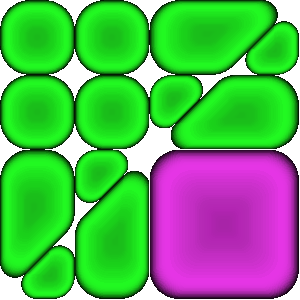
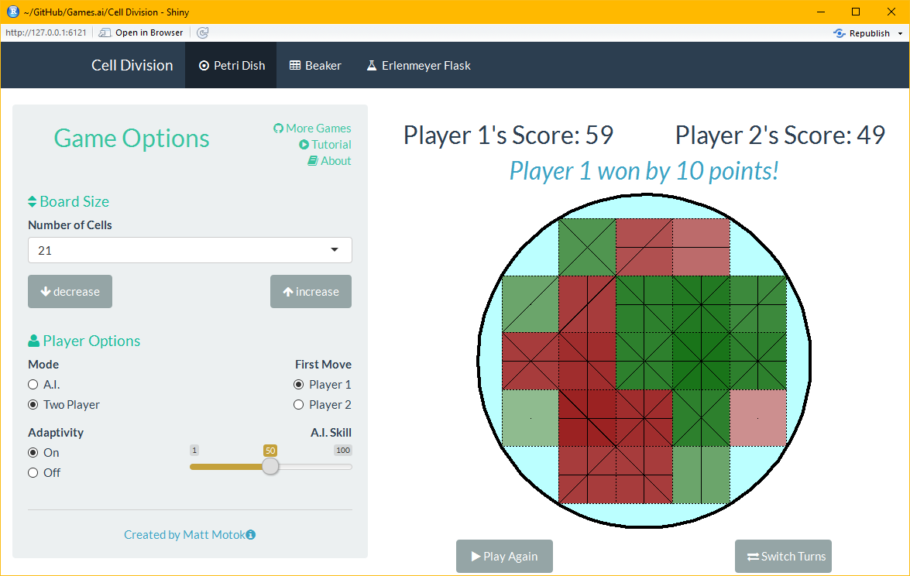

<!--
simplex
cosmo
united
readable
-->


# Introduction 
Cell Addition is a strategy-based board game.  All A.I. opponents implement a deterministic strategy that is greedy with respect to an approximate value function.  Games against a fixed difficulty A.I. opponent are reproducible.  

## How to Play
Player take turns placing their cells. A player's cells divide when they connect with each other; vertical, horizontal and diagonal connections are allowed.  
```{r, out.width = "100px", echo=FALSE}

```

Your score is equal to the total number of cell that you have on the board.  The game ends when the board is full and the winner is the player with the most cells. 

## Features
In the current implementation of the game, there are three fixed-difficulty ai opponents.  The R implementation also has an adaptive opponent that plays differently depending on how much it is winning/losing by.

The current implementation has three square grid board configuratios. The R implementation has board configurations that are more flexible.  In the break and flask layouts, gravity applies to moves played (cells fall to the lowest open row).


# Implementation

## R 
Cell Division was originally written using R Shiny which converts R code into HTML, CSS and Javascript. The code for the original game is available [here](https://github.com/mattmotoki/Games.ai/tree/master/Cell%20Division) and can be played [here](https://mmotoki.shinyapps.io/cell_division/).  R Shiny is geared more towards interactive data analytics and is not well-suited for this type of game.  


## HTML, CSS and Javascript
The current implementation of the game is writen in plain HTML, CSS and Javascript.  The code is available [here](https://github.com/mattmotoki/mattmotoki.github.io) and can be played  [here](https://mattmotoki.github.io/).  This implementation lacks a few features of the R implementation, but overall it is a better implementation. 


# Technical Stuff
## Creating The Cells
The visuals in this R implementation are limited; e.g.,
```{r, out.width = "500px", echo=FALSE}

```

Cartoon-like cells look better than overlaid squares and lines.  This section describes the process of creating cell images from scratch using base R graphics.  The images can then be loaded and displayed as buttons in the game. 


### Defining the Outline
Cells are drawn as layered polygons in base R.  Before calling the `polygon` functiona new plot needs to be created.  The `blank_plot` function creates a new empty plot and draws lines to highlight the edges of the cell which we will be at 0 and 1 in both directions. 
```{r}
blank_plot <- function() {
  par(mar=c(0,0,0,0), bg=NA)
  plot(1, type="n", asp=1, axes=FALSE, 
       yaxs="i", xaxs="i", xlab = "", ylab = "",
       xlim = c(-0.1, 1.1), ylim = c(-0.1, 1.1)
  )
}
```
The natural way to define the outline of a cell is in terms of its $x$ and $y$ coordinates.  Alternatively, the outline can be parameterized by an angle $\theta\in[0,\, 2\pi]$ and a radius $r$ and then mapped back to the $xy$-plane using the formulas
$$
x = r\cdot \cos(\theta)
\qquad
\qquad
y = r\cdot \sin(\theta).
$$
A simplifying trick is to specify only the curved sections of the outline and let R automatically create the straight sections by connecting the curves.  Another simplification comes by specifying one pivot point per curved section rather than pivoting about a single origin. 

The following two functions use this method to create the outline of triangular cells
```{r}
triangular_cell <- function(r, r2, n_pnts) {
  R <- rep(r, n_pnts)
  R2 <- rep(r2, n_pnts)
  
  theta <- c(seq(0, pi/2, length.out = n_pnts), 
             seq(pi/2, 5*pi/4, length.out = n_pnts),
             seq(5*pi/4, 2*pi, length.out = n_pnts))
  
  x_pivots <- c(1-R, R2*(1+sqrt(2)),  1-R2) - 0.5
  y_pivots <- c(1-R, 1-R2,  R2*(1+sqrt(2))) - 0.5
  
  cbind(
    c(R, R2, R2)*cos(theta) + x_pivots,
    c(R, R2, R2)*sin(theta) + y_pivots
  )
}

# variant
side_triangular_cell <- function(r, r2, n_pnts) {
  R <- rep(r, n_pnts)
  R2 <- rep(r2, n_pnts)
  
  theta <- c(seq(0, 3*pi/4, length.out = n_pnts),
             seq(3*pi/4, 5*pi/4, length.out = n_pnts),
             seq(5*pi/4, 2*pi, length.out = n_pnts))
  
  x_pivots <- c(1-R, 0.5+sqrt(2)*R2, 1-R) - 0.5
  y_pivots <- c(1-(1+sqrt(2))*R, rep(0.5, n_pnts), (1+sqrt(2))*R) - 0.5
  
  cbind(
    c(R, R2, R)*cos(theta) + x_pivots,
    c(R, R2, R)*sin(theta) + y_pivots
  )
}
```

Multiple cells can be drawn with translations, rotations and reflections of the original outline. For example,
```{r, fig.width=4, fig.height=4, fig.align='center' }
# create outlines
side_tri_outline <- side_triangular_cell(0.1, 0.3, 10)
side_tri_x <- side_tri_outline[, 1]+0.5
side_tri_y <- side_tri_outline[, 2]+0.5

sm_tri_outline <- triangular_cell(0.3, 0.2, 10)
sm_tri_x <- 0.5*(sm_tri_outline[, 1]+0.5)
sm_tri_y <- 0.5*(sm_tri_outline[, 2]+0.5)

# plot cells and show points
blank_plot()
abline(h=c(0,1), v=c(0,1))
cellgreen <- c(34/255,250/255,34/255)
poly_and_points <- function(x, y) {
  polygon(x, y, col=rgb(cellgreen[1], cellgreen[2], cellgreen[3]))
  points(x, y)
}

poly_and_points(sm_tri_x+0.5, 1-sm_tri_y) # top right
poly_and_points(sm_tri_x+0.5, sm_tri_y)   # bot right
poly_and_points(0.5-sm_tri_x, 1-sm_tri_y) # top left
poly_and_points(0.5-sm_tri_x, sm_tri_y)   # bot left
poly_and_points(side_tri_y, 1-side_tri_x) # bottom 
poly_and_points(side_tri_y, side_tri_x)   # top
```


### Shading About the Centroid
There are two types of shading used to create the cells.  Both types of shading are implemented by overlaying a sequence of polygons centered about the center of mass with either decreasing/increasing size and decreasing/increasing transparency. 

The centroid of a polygon is 
$$
\begin{split}
C_x &= \frac{1}{6A} \sum_{i=0}^{n-1} (x_i + x_{i+1}) (x_i \cdot  y_{i+1} - x_{i+1} \cdot y_i)\\
C_y &= \frac{1}{6A} \sum_{i=0}^{n-1} (y_i + y_{i+1}) (x_i \cdot  y_{i+1} - x_{i+1} \cdot y_i)\\
\end{split}
$$
where 
$$
A = \frac{1}{2} \sum_{i=0}^{n-1} (x_i \cdot  y_{i+1} - x_{i+1} \cdot y_i).
$$
```{r}
circularShift <- function(x,shift=0) {
  N <- length(x)
  K <- shift %% N
  if(K == 0) x else c(x[(N-K+1):N],x[1:(N-K)])
}

centroidCalc <- function(x, y) {
  shift_x <- circularShift(x, 1)
  shift_y <- circularShift(y, 1)
  d <- x*shift_y - shift_x*y
  c(sum( (x+shift_x)*d ), sum( (y+shift_y)*d ) ) / (3*sum(d))
}
```

The shading for the outline of the cell uses a decreasing sequence of polygon size and transparency.  On the other hand, the shading that creates depth in the middle of the cell uses an increasing sequence of polygon size and transparency.

```{r, fig.width=4, fig.height=4, fig.align='center' }
library(png)
# plot a single cell with shadow and dimple
plot_cell <- function(x, y, color) {
  centroid <- centroidCalc(x, y)
  
  # add shadow
  n_layers <- 100
  shrink <- seq(1, 0,length=n_layers)
  alpha <- seq(0.1, 1, length=n_layers)
  polygon(x, y, col="black", border=NA)
  for (k in 1:n_layers) {
    polygon(shrink[k]*(x-centroid[1])+centroid[1],
            shrink[k]*(y-centroid[2])+centroid[2],
            col=rgb(color[1], color[2], color[3], alpha[k]),
            border=NA) 
  }
  
  # add dimple
  n_layers <- 25
  shrink <- seq(0.25, 0.85, length=n_layers)^2
  alpha <- seq(0.01, 0.05, length=n_layers)
  color <- 0.5*color
  for (k in 1:n_layers) {
    polygon(shrink[k]*(x-centroid[1])+centroid[1],
            shrink[k]*(y-centroid[2])+centroid[2],
            col=rgb(color[1], color[2], color[3], alpha[k]),
            border=NA)
  }
}

# plot cells
blank_plot()
abline(h=c(0,1), v=c(0,1))

plot_cell(sm_tri_x+0.5, 1-sm_tri_y, color=cellgreen) # top right
plot_cell(sm_tri_x+0.5, sm_tri_y, color=cellgreen)   # bot right
plot_cell(0.5-sm_tri_x, 1-sm_tri_y, color=cellgreen) # top left
plot_cell(0.5-sm_tri_x, sm_tri_y, color=cellgreen)   # bot left
plot_cell(side_tri_y, 1-side_tri_x, color=cellgreen) # bottom
plot_cell(side_tri_y, side_tri_x, color=cellgreen)   # top
```


 

## A.I. Opponent
All oppponents are greedy with respect to some approximation of the value of a move.  The quality of the approximation determines the difficulty of the opponent.  Since the objective is to maximize your score, it makes sense to approximate the long term benefit of a move with its immediate increase in score.  It turn's out that the increase in score can be decomposed in the a function of the following four variables: 

* $\text{overlap}_p(\text{move})$ is the number of cells adjacent to a move,
* $\text{interlap}_p(\text{move})$ is the number of times the move is sandwitched by its cell and its opposite,
* $\text{extensions}_p(\text{move})$ is the number of existing connections that a move extends,
* $\text{unconnected}_p(\text{move})$ is the number of unconnected cells that a move connects,

and the formula is 

$$\begin{split}
\Delta \text{score}_p(\text{move}) 
&= \mathbb{I} \{\text{overlap}_p(\text{move})>1\} - \text{unconnected}_p(\text{move}) \\
&\quad + 2\cdot \big[\text{overlap}_p(\text{move}) - \text{interlap}_p(\text{move})\big] \\
&\quad + 2\cdot\big[  \text{overlap}_p(\text{move})  - \text{extensions}_p(\text{move}) \big],
\end{split}$$
where $p$ denotes the player playing the move.  By convention, define the first player ($p=1$) to be you and the second player ($p=2$) to be the A.I.  
One benefit of this decomposition is that each of the variables can be updated in an online fashion.   

Additional player-independent variables that have intuitive value are:

* $\text{openness}(\text{move})$ is move number of open positions adjacent to a move,
* $\text{centrality}(\text{move})$ measures how close a move is to the center of the board.

To calculate a value of a move, the ai opponent uses a weighted sum of the above variables.

### Easy, Medium and Hard Opponents
Cell Addition is a zero sum game and so your gain is the same as the ai's loss.  Thus, when designing the ai, it will be beneficial to take this into account. 

The easy ai's value function is simply
$$
\text{easy}(\text{move}) = \text{centrality}(\text{move});
$$
that is, the easy ai just places it's move in the center most position of the board with ties broken arbitrarily.

The hard ai's value function is 
$$
\begin{split}
\text{hard}(\text{move}) 
& = \text{centrality}(\text{move}) + 2\cdot \text{openness}(\text{move})\\
& \quad + \big[ \Delta \text{score}_2(\text{move}) + \Delta \text{score}_1(\text{move}) \big]\\
&\quad - \big[ \text{overlap}_2(\text{move}) + \text{overlap}_1(\text{move}) \big]
.
\end{split}
$$
The idea is to find a tradeoff between exploration and exploitation.  To see this, consider the following formula for the increase in the total overlap of a board when playing $\text{move}$
$$
\Delta\text{total_overlap}_p(\text{move}) = \text{openness}_p(\text{move}) - \text{overlap}_p(\text{move}).
$$
The hard ai's value approximation can now be rewritten as
$$
\begin{split}
\text{hard}(\text{move}) 
& = \text{centrality}(\text{move}) \\
& \quad + \big[ \Delta \text{score}_2(\text{move}) + \Delta \text{score}_1(\text{move}) \big]\\
& \quad + \big[ \Delta\text{total_overlap}_2(\text{move}) + \Delta\text{total_overlap}_1(\text{move}) \big]
.
\end{split}
$$
The two first two terms after $\text{centrality}$ encourage exploitation of the current game state while the last two terms encourage exploration of the board.  

The medium ai's value is the average of the easy and hard opponent's values; i.e., 
$$
\text{medium}(\text{move}) =
0.5\cdot \text{hard}(\text{move})  + 
0.5\cdot \text{easy}(\text{move}) .
$$


### Adaptive (R implementation only)
The adaptive ai has a skill level which determines the overall strategy in a game.  

The adaptive ai adapts to your play in two ways: 

1. It adapts to your play within a game.
2. It adapts its entire strategy after a game.


The adaptive ai uses a convex combination of the easy and hard ai's value approximation.  
$$
\text{adaptive}(\text{move}) 
= \text{skill}' \cdot \text{hard}(\text{move})
+ (1 - \text{skill}') \cdot  \text{easy}(\text{move}),
$$
where $\text{skill}'$ is modified (within-game) skill parameter

$$
\text{skill}' = \text{skill} + 0.01\cdot ( \text{your_score} - \text{ai_score} ).
$$
Notice that if you are winning, then the effective skill of the ai goes up.  Moreover, if you are winning by a lot then the effective skill will go up by a lot.  

At the end of the game, the ai's skill level is updated according to the following formula:
$$
\text{skill} \leftarrow \text{skill} + 0.01\cdot  \frac{ \text{your_score} - \text{ai_score}  }{1 + \mathbb{I} \{ \text{your_score} < \text{ai_score} \}  }.
$$
Hence, if you beat the ai, then its skill goes up by the score difference; if you lose, then its skill goes down in proportion to half the absolute score difference.  If the game is a draw, then the skill level stays the same.

Ignoring within-game adaptivity, when $\text{skill}=0$ you are essentially playing against the easy ai, when $\text{skill}=1$ you are playing against the hard ai, and when $\text{skill}=0.5$ you are playing against the medium ai.


# Future Add-Ons
There are many variations on this game that can be played.  What follows is an unordered list of possible improvements/variants of the game.

* **Stem Cells**: Undifferentiated cell that can become partially colored once fully surrounded.  If fully surrounded, the center of the stem cells can also be colored, resulting in a cell with a total of nine divisions.  

* **Early Stopping**: Getting the first move can be an advantage, especially on the medium board configuration.  To mitigate this, the game can stop a few rounds early.  For example, in the medium board configuration, if the game stops one round early then both players will get have an equal number o moves.  

* **Attack Moves**: Give players access to the strong acid HCl and the strong base NaOH.  Each acid/base will destroy the other player's cells while leaving their cells intact.  Similarly, isopropyl alcohol can be played to destroy any cell.  
+ **Sythesis Process**: Let NaOH/HCl and isopropyl alcohol regenerate over time. 
+ **cell Walls**: Let players enforce their cells with cell walls (or membranes) to guard against HCl/NaOH/Alcochol attacks. 


* **Alternative Objectives**: Instead of placing cells on the board, we can start with a given number of each player's cells in a predefined configuration.  You are allowed to move a cell one step in any direction or swap your cell with an opponent's adjacent cell.  Cells continue to divide based on thier connections.  The end of a game occurs after a fixed number of moves. The winner is the player with the most cells at the end of the game.  
+ **Cell Swap**: Let player's swap their cell's with their oppoent's; 
+ **Cell Jumps**: Let players jump their opponent's cells (as in checkers) to convert them to one of their own.

* **Triangular and Hexagonal Grids**: Storing a board defined over these grids can be done by modifying what it means to be adjacent to another cell.  Thus, boards can be stored and analyzed in a similar way to the rectangular grid.  The approximations that the A.I. opponents use will probably also generalize well to these types of grids. 


* **Modified Scoring**: One of the problems with this game is that the scoring system --- although well-defined --- is not very intuitive.  A more natural scoring system may be to count the number of connections rather than the number of divisions.


* **Cell Capture**: This is a <a href="https://en.wikipedia.org/wiki/Go_(game)" target="_blank">Go</a>-like feature which allows you to convert your opponent's cells into your own.  This is achieved by completely surrounding your opponent's cells or sandwiching them between the edge of a board and your cells.  


* **Partial Cells**: Allow and score partial cells. Triangular cell's might not be too hard to add in. 


* **Custom Board Builder**: Create a GUI that allows the user to click on a grid to define the feasible positions of thier custom board.  Boards can naturally be stored as a binary matrix, thus it would be easy to let the user save and upload thier board.  


